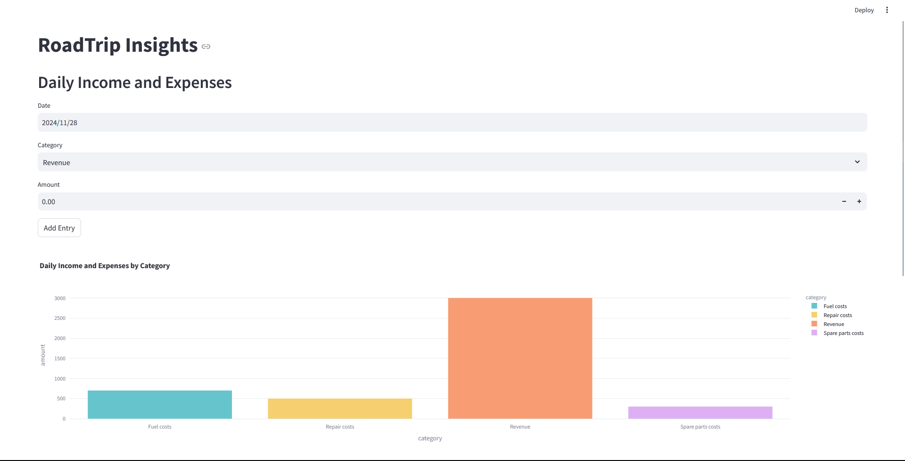
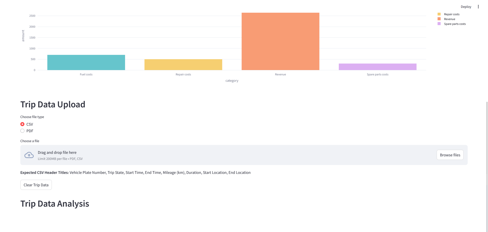

# RoadTrip Insights - Vehicle Operational Data Management Application

This Streamlit application manages and analyzes vehicle operational data, including daily income/expenses and trip details.

## Features

- **Daily Income & Expense Management:** Input and track daily income and expenses categorized by type (Revenue, Fuel, Repair, Spare Parts). Data is stored in an SQLite database.  
- **Trip Data Handling:** Upload trip data from CSV or PDF files.  Data is stored in an InfluxDB time-series database. 
- **Dashboard & Visualization:** Interactive charts and tables visualize financial data and trip reports (daily income/expenses, profit/loss, total distance, average trip duration, trip timeline). 
- **Data Clearing:** Clear all trip data from InfluxDB.

## Setup

1. **Prerequisites:**
   - Docker
   - Docker Compose
   - Python 3.9+
   - `pip install -r requirements.txt` (or `conda install --file requirements.txt`)

2. **Environment Variables:** Create a `.env` file with the following variables:
   - `INFLUX_URL`: InfluxDB URL (e.g., `http://localhost:8086`)
   - `INFLUX_TOKEN`: Your InfluxDB token
   - `INFLUX_ORG`: Your InfluxDB organization
   - `INFLUX_BUCKET`: Your InfluxDB bucket name (e.g., `vehicle_trips`)
   - `SQLITE_DB`: Path to your SQLite database (e.g., `vehicle_data.db`)

3. **Run:**
   - `docker compose up -d`
   - Access the application at `http://localhost:8501`

## Usage

- Enter daily income and expenses using the provided form.
- Upload trip data using either a CSV or PDF file.  CSV files should follow the specified header format.
- Use the interactive charts and tables to analyze financial and trip data.
- Use the "Clear Trip Data" button to clear all trip data from InfluxDB.

## Notes

- The PDF parsing functionality might require further refinement depending on the PDF's structure.  CSV upload is generally more reliable.
- Ensure that InfluxDB is running and accessible before starting the application.
